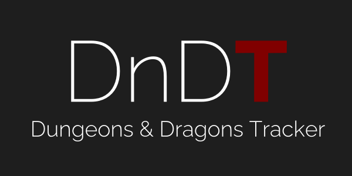

<p align="center">
    <a href="https://dndt.app" target="_blank">
        
    </a>
</p>


<p align="center">
    <a href="/cryocaustik/dndt">
        
    </a>
    <a href="https://packagist.org/packages/laravel/framework"></a>
    <a href="/cryocaustik/dndt">
        
    </a>
    <a href="/cryocaustik/dndt">
        
    </a>
    
</p>

## About DnDT

DnDT - Dungeons and Dragons Tracker, is a simple tracking tool to help track various things across campaigns.

While application originated with the goal of tracking a shared inventory, I do hope to expand it to tracking shared contacts, locations, and maybe documents/notes.

### Inventory Tracking

Tracking inventories in DnDT is designed to give a historical log of items coming in and out, while still giving users a simple summary and ability to filter the history by varying elements.


## Powered By 

The application is built on Laravel as the backend, which serves up VueJS as the front end, creating a nimble and extensible experience.

Backend:

- [Laravel v8.x](https://laravel.com/)
- [Sanctum (session based authentication)](https://laravel.com/docs/8.x/sanctum)
- [Socialite (third party SSO)](https://laravel.com/docs/8.x/socialite)

Frontend:

- [VueJS v2.x](https://vuejs.org/)
- [Vuetify (UI library)](https://vuetifyjs.com/en/)
- [Axios (http requests FE to BE)](https://github.com/axios/axios)

## Setup

Setting up the application on a [LEMP server](https://www.digitalocean.com/community/tutorials/how-to-install-linux-nginx-mysql-php-lemp-stack-on-ubuntu-20-04)

**Note** the server should have the following installed and configured

- MySQL
- Nginx
- Composer
- Nodejs with NPM

### Clone repository into your web directory

```sh
git clone git@github.com:cryocaustik/dndt.git /var/www/dndt
cd /var/www/dndt
```

### Composer Install

Using composer, install dependencies

```sh
composer install
```

or in docker

```sh
docker run -it --rm -v $(pwd):/var/www/html -w /var/www/html composer install
```

### Setup .env

Copy .env.example and generate an app key

```sh
cp .env.example .env
php artisan key:generate
```

Adjust the keys as needed for your use, at the very least setting

```conf
APP_ENV=production
# your domain, with http schema
APP_URL=http://yourdomain.com

# your domain, without the http schema
SANCTUM_STATEFUL_DOMAINS=yourdomain.com

# your database credentials for the application
DB_CONNECTION=mysql
DB_HOST=127.0.0.1
DB_PORT=3306
DB_DATABASE=dndt
DB_USERNAME=web_app_db_user
DB_PASSWORD=super_secret_password

# (optional) credentials and details for email provider (e.g. mailtrap, mailgun)
MAIL_MAILER=smtp
MAIL_HOST=smtp.mailtrap.io
MAIL_PORT=2525
MAIL_USERNAME=null
MAIL_PASSWORD=null
MAIL_ENCRYPTION=null
MAIL_FROM_ADDRESS=null

# (optional) Discord SSO credentials and redirect
DISCORD_CLIENT_ID=
DISCORD_CLIENT_SECRET=
DISCORD_REDIRECT=
```

### Build Frontend 

Run build script to pull frontend dependencies and build it

```sh
npm run prod
```

### Cofigure and Enable Nginx Conf

Create the Nginx configuration

```sh
vi /etc/nginx/sites-available/dndt.conf
```

using the following inside 

```conf
server {
    listen 80;
    server_name example.com;
    root /var/www/dndt/public;

    add_header X-Frame-Options "SAMEORIGIN";
    add_header X-XSS-Protection "1; mode=block";
    add_header X-Content-Type-Options "nosniff";

    index index.php;

    charset utf-8;

    location / {
        try_files $uri $uri/ /index.php?$query_string;
    }

    location = /favicon.ico { access_log off; log_not_found off; }
    location = /robots.txt  { access_log off; log_not_found off; }

    error_page 404 /index.php;

    location ~ \.php$ {
        fastcgi_pass unix:/var/run/php/php7.4-fpm.sock;
        fastcgi_param SCRIPT_FILENAME $realpath_root$fastcgi_script_name;
        include fastcgi_params;
    }

    location ~ /\.(?!well-known).* {
        deny all;
    }
}
```

Enable the configuration and reload Nginx

```sh
ln -s /etc/nginx/sites-available/dndt.conf /etc/nginx/sites-enabled/
nginx -s reload
```

### Done

Your app should now be live at your `APP_URL`

## Contributing

I am an amatuer with both, Laravel and VueJS and I am sure there are a lot of areas to improve on. If you would like to contribute to improve/fix/expand DnDT, feel free to open a PR.

Please keep in mind that the application is still in development and NOT in stable release.

## Code of Conduct

In order to ensure that the Laravel community is welcoming to all, please review and abide by the [Code of Conduct](https://laravel.com/docs/contributions#code-of-conduct).

## Security Vulnerabilities

If you discover a security vulnerability within DnDT, please send an e-mail to [dndt@alazy.dev](mailto:dndt@alazy.dev).

## License

DnDT is open-sourced software licensed under the [MIT license](https://opensource.org/licenses/MIT).
